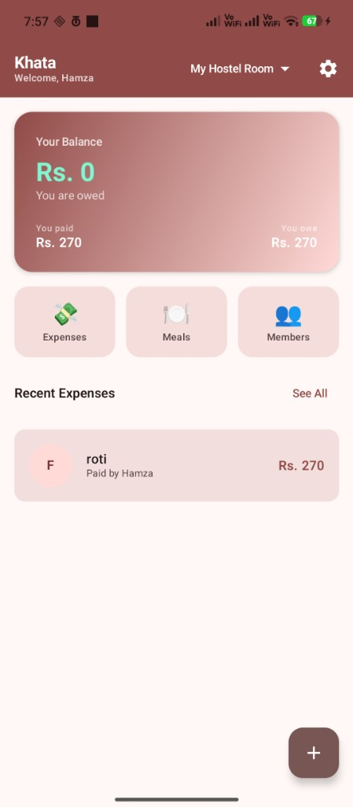
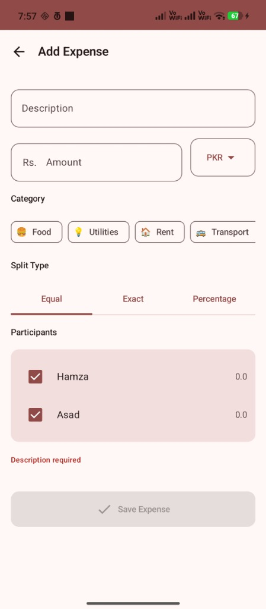
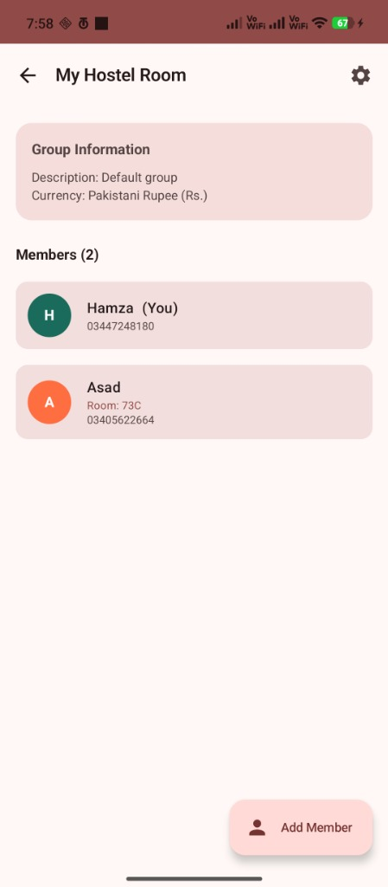
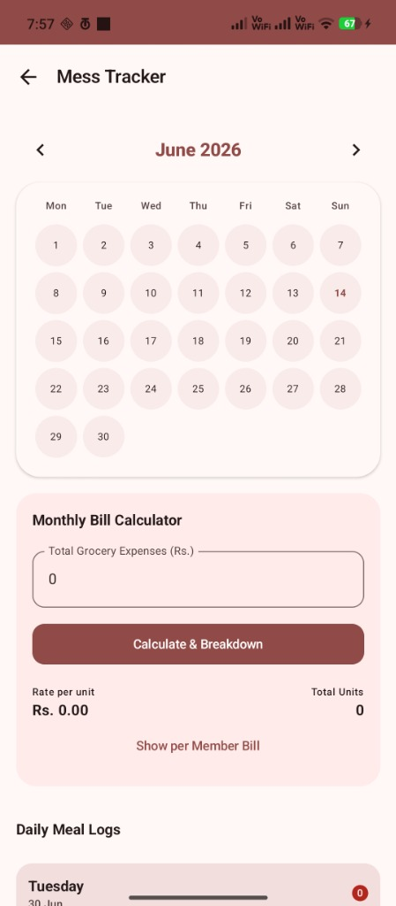

# Khata: Real-Time Decentralized Financial Ledger and Mess Tracker

### Academic Project Documentation
**Supervised by:** Mam Wajeeha Azmat 
**Submitted by:** Muhammad Hamza Saqib  
**Repository Link:** [https://github.com/hamzasaqib80/Khata](https://github.com/hamzasaqib80/Khata)  
**Latest Release (APK):** [Direct Download APK](https://github.com/hamzasaqib80/Khata/releases/download/v1.0.0/app-debug.apk)

---

```
 ██╗  ██╗██╗  ██╗ █████╗ ████████╗ █████╗ 
 ██║ ██╔╝██║  ██║██╔══██╗╚══██╔══╝██╔══██╗
 █████╔╝ ███████║███████║   ██║   ███████║
 ██╔═██╗ ██╔══██║██╔══██║   ██║   ██╔══██║
 ██║  ██╗██║  ██║██║  ██║   ██║   ██║  ██║
 ╚═╝  ╚═╝╚═╝  ╚═╝╚═╝  ╚═╝   ╚═╝   ╚═╝  ╚═╝
```

> **A 100% offline, cryptographically secure financial management application built natively for Android, designed to solve complex roommate expense splitting and hostel mess bill tracking.**

---

## 📖 1. Project Overview

**Khata** is an advanced mobile application specifically engineered to handle the financial complexities of communal living, such as university hostels and shared apartments. Unlike standard expense trackers, Khata introduces a highly robust **Real-Time Reactive Architecture** combined with a specialized **Daily Meal (Mess) Tracker**, allowing residents to log daily meals and automatically calculate proportional monthly grocery consumption bills accurate to the decimal.

### Statement of Purpose
To eliminate the friction, inaccuracies, and disputes involved in manual ledger keeping amongst roommates by providing an automated, mathematically rigorous, and offline-first Android application.

---

## ✨ 2. Core Features & Capabilities

1. **Reactive Financial Engine (Real-Time Balances)**
   - Powered by Kotlin `Flow`, the dashboard reflects real-time aggregation of expenses versus active settlements. 
   - Every transaction updates the "You Paid", "You Owe", and "Net Balance" mathematically without requiring manual synchronization.
2. **Advanced Meal (Mess) Tracker**
   - Interactive calendar layout allowing users to toggle Breakfast (B), Lunch (L), and Dinner (D) logs.
   - **Automated Bill Calculator:** Distributes the total monthly grocery cost across members based on individual meal consumption weights.
3. **Debt Simplification Algorithm**
   - Utilizes a Greedy $O(N \log N)$ algorithmic approach functioning as a dual-heap. It systematically minimizes the total number of transactions required to settle complex web debts between multiple roommates.
4. **SQLCipher Local Security**
   - All internal Room databases are encrypted at rest via AES-256 to ensure extreme data privacy for financial records.
5. **Dynamic UI & Material Design 3**
   - Fully optimized for Android 12+, incorporating fluid animations, dynamic theming (Dark/Light mode), and robust exception handling for state restoration.

---

## 🏛 3. System Architecture

The application rigorously follows the **Clean Architecture** patterns encouraged by Google to decouple business logic from the UI.

```text
[ Presentation Layer (Compose + ViewModel) ]
                    │
[      Use Cases (Business Logic)          ]
                    │
[    Repository Interfaces (Domain)        ]
                    │
[  Repository Implementations (Data)       ]
                    │
[   Room DAOs + SQLCipher Database         ]
```

### Key Technical Decisions:
* **Precision Math:** Absolute usage of `BigDecimal` for all monetary entries preventing dangerous floating-point arithmetic errors.
* **Coroutines & Dependency Injection:** Heavy SQL queries and algorithms execute safely on `Dispatchers.IO` and `Dispatchers.Default`, utilizing `Hilt` for lifecycle-aware dependency injection.
* **Reactive UI:** Continuous state observation using `StateFlow` and `collectAsStateWithLifecycle()` guarantees UI consistency even through Android process deaths.

---

## 🛠 4. Technology Stack

| Technology | Purpose | Version |
|---|---|---|
| **Kotlin** | Core Programming Language | 2.0.0 |
| **Jetpack Compose** | Declarative UI Toolkit | BOM 2024.09.00 |
| **Room Database** | Offline SQLite Object Mapping | 2.6.1 |
| **Hilt (Dagger)** | Dependency Injection | 2.52 |
| **Coroutines & Flow** | Asynchronous / Reactive stream handling | 1.8.1 |
| **SQLCipher** | AES-256 Database Encryption | 4.5.6 |
| **Navigation Compose**| Type-safe UI Routing | 2.8.0 |

---

## 📸 5. Interface Showcase

Here is a glimpse of the Khata application interfaces demonstrating the custom UI implementation:

### 1. Dashboard Overview
Provides immediate insights into Net Balances, Recent Expenses, and quick action navigation.


### 2. Expense Addition
Categorized expense allocation providing parameters for Equal, Percentage, or Exact splits among participants.


### 3. Member Initialization & Group Info
Hostel setup providing identity management and connection details (Phone, Room No).


### 4. Mess (Meal) Tracker
Visual calendar heat-map providing daily meal logs and automated grocery bill computation.


---

## 🚀 6. Installation & Deployment

### Compile from Source (GitHub)
```bash
# 1. Clone the repository
git clone [Insert GitHub Link Here]

# 2. Open in Android Studio (Hedgehog or newer)
cd khata

# 3. Target JDK 17 & Sync Gradle
# 4. Press 'Run' to install on an emulator/device.
```

### Pre-Built Binary (APK)
The compiled Debug APK is provided alongside this documentation to sideload onto any Android 8.0+ (API 26+) device.

---

## 🧪 7. Future Scope
* **Cloud Synchronization:** Integration with Firebase/Supabase for real-time multi-device sync.
* **OCR Receipt Scanning:** Leveraging ML Kit to scan grocery receipts automatically into the ledger.

---
*Developed By Muhammad Hamza Saqib.*
